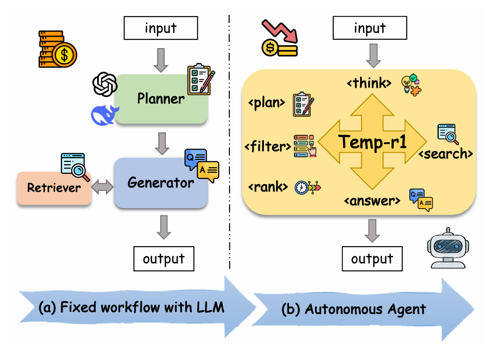
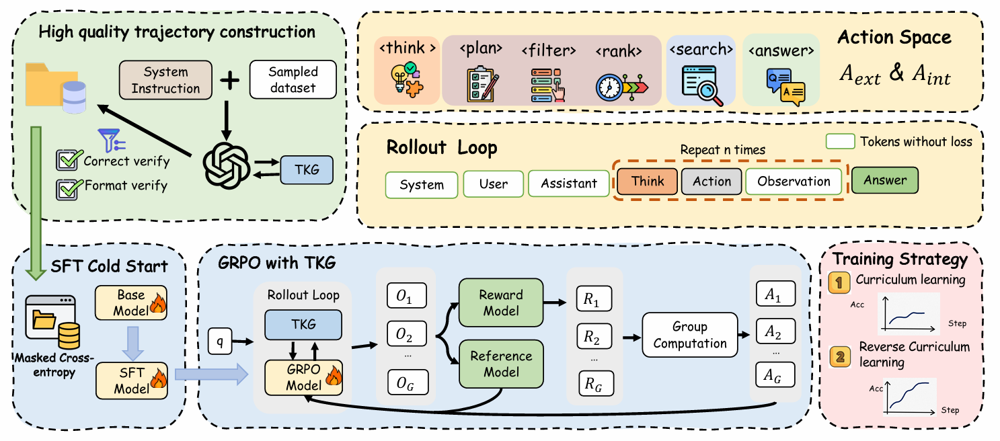
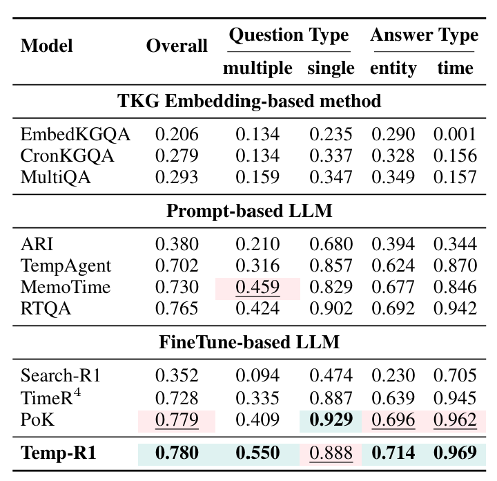
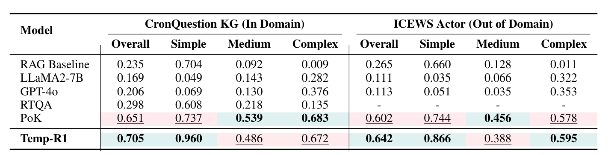
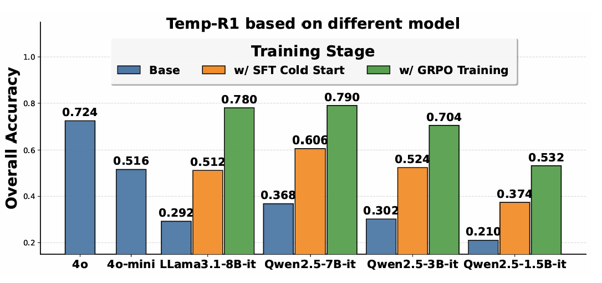
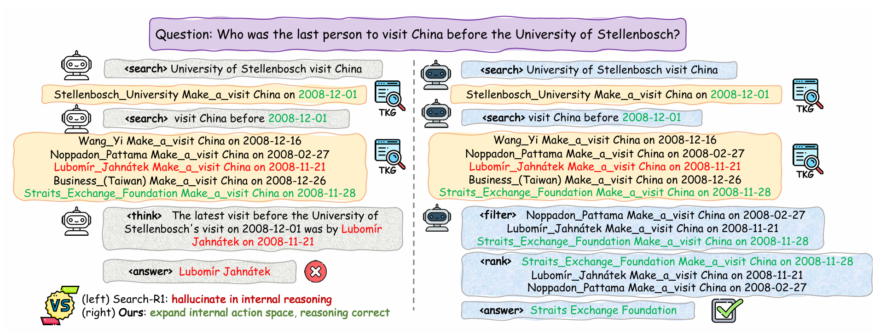

# Temp-R1: A Unified Autonomous Agent for Complex Temporal KGQA via Reverse Curriculum Reinforcement Learning

[]((https://arxiv.org/abs/2601.18296))
[](https://github.com/zjukg/Temp-R1)

This is the official repository for the paper: **"Temp-R1: A Unified Autonomous Agent for Complex Temporal KGQA via Reverse Curriculum Reinforcement Learning"**, accepted at **ACL 2026 (Main Conference)**.


## 🔥 News

- **[2026-04]**  We will release our data and code on Github before 2026-4-30.
- **[2026-04]**  Temp-R1 is accepted to **ACL 2026 (Main Conference)**!🎉🎉🎉
- **[2026-01]**  Paper released on arXiv.


## 🚀 Overview

**Temp-R1** is an autonomous end-to-end agent for Temporal Knowledge Graph Question Answering (TKGQA) trained through reinforcement learning. 

Existing TKGQA methods often rely on fixed workflows or expensive closed-source APIs. Temp-R1 breaks this paradigm by:
1.  **Expanded Action Space**: Decoupling internal reasoning into specialized tags (`<plan>`, `<filter>`, `<rank>`, `<think>`) alongside external tool use (`<search>`).
2.  **Reverse Curriculum Learning**: A counter-intuitive training strategy that prioritizes complex multi-hop queries first, forcing the model to master sophisticated reasoning before transferring to simpler cases.
3.  **State-of-the-Art Performance**: Outperforming GPT-4o-based baselines and achieving significant improvements (up to 19.8%) on complex temporal questions.

<p align="center">
  
  <br/>
  <em>Figure 1: Introduction and motivation of Temp-R1.</em>
</p>

<p align="center">
  
  <br/>
  <em>Figure 2: Overall architecture of Temp-R1.</em>
</p>

## 🌟 Key Features

- **Autonomous Tool Use**: Dynamically decides when to search, filter, and rank temporal facts.
- **GRPO Training**: Optimized using Group Relative Policy Optimization (GRPO) to internalize complex temporal constraints.
- **Open-Source Backbone**: Built on Llama-3.1-8B-Instruct, providing a cost-effective alternative to proprietary models.
- **Robust Generalization**: Strong performance across MULTITQ and TIMELINEKGQA benchmarks.


## 🛠️ Installation

### 1. Clone the repository:
```bash
git clone https://github.com/zjukg/Temp-R1.git
cd Temp-R1
```
### 2. Create a conda environment and install dependencies:
```bash    
conda create -n tempr1 python=3.9
conda activate tempr1

# install torch [or you can skip this step and let vllm to install the correct version for you]
pip install torch==2.4.0 --index-url https://download.pytorch.org/whl/cu121

# install vllm
pip3 install vllm==0.6.3 # or you can install 0.5.4, 0.4.2 and 0.3.1
# verl
pip install -e .

# flash attention 2
pip3 install flash-attn --no-build-isolation
pip install wandb

# install llama-factory
cd LLaMA-Factory
pip install -e .
pip install -r requirements/metrics.txt
```


### 3. Create a retriever environment:
```bash
conda create -n retriever python=3.10
conda activate retriever

# we recommend installing torch with conda for faiss-gpu
conda install pytorch==2.4.0 torchvision==0.19.0 torchaudio==2.4.0 pytorch-cuda=12.1 -c pytorch -c nvidia
pip install transformers datasets pyserini

## install the gpu version faiss to guarantee efficient RL rollout
conda install -c pytorch -c nvidia faiss-gpu=1.8.0

## API function
pip install uvicorn fastapi
```

## 📊 Data Preparation
We evaluate on three major TKGQA benchmark
- MULTITQ
- TIMELINEKGQA-CRON
- TIMELINEKGQA-ICEWS-ACTOR (Out-of-domain evaluation)

Please download the datasets and place them in the ```/data/MultiTQ/``` and ```/data/TimelineKGQA/```.
### (1) Prepare for TKGs
```bash
python scripts/convert_kg_to_jsonl.py
bash search_r1/search/build_index.sh
```
### (2) Launch a local retrieval server.
```bash
conda activate retriever
bash retrieval_launch.sh
```
### (3) Prepare for SFT training data.
```bash 
python scripts/data_process/qtype_classify.py
python scripts/data_process/create_oversampled_dataset.py
bash scripts/data_process/generate_sft_tra.sh
python scripts/data_process/llama-factory-dataset.py
```
### (4) Prepare for GRPO training data.
```bash
python scripts/data_process/multitq_search.py
```

## 🚂 Training Pipeline
Temp-R1 follows a two-stage training process:
### Phase 1: SFT Cold-Start
Initialize the model with high-quality reasoning trajectories:
```bash
llamafactory-cli train LLaMA-Factory/examples/train_full/tempr1_full_sft.yaml
```
### Phase 2: Reverse Curriculum Reinforcement Learning
Train the agent using GRPO with our reverse curriculum strategy:
```bash
bash scripts/multitq/train_grpo_stage1.sh
bash scripts/multitq/train_grpo_stage2.sh
```

## 📌 Inference 
### (1) Launch a local retrieval server.
```bash
conda activate retriever
bash retrieval_launch.sh
```
### (2) Run inference.
```bash
conda activate tempr1
bash scripts/multitq/evaluate.sh
```


## 📈 Main Results
<p align="center">
  
</p>

<p align="center">
  
</p>

<p align="center">
  
</p>

<p align="center">
  <em>Figure 3: Main experimental results on TKGQA benchmarks.</em>
</p>


## 🧩 Case Study
Comparison of internal reasoning mechanisms: Temp-R1 vs. Search-R1.
<p align="center">
  
  <br/>
  <em>Figure 4: Case study comparing reasoning processes of Temp-R1 and Search-R1.</em>
</p>

## 🙏 Acknowledgements
This work is implemented based on [Search-R1](https://github.com/petergriffinjin/search-r1), [VeRL](https://github.com/volcengine/verl), and [LLama Factory](https://github.com/hiyouga/LLaMAFactory). We sincerely thank the authors of these projects for their valuable contributions to the open-source community.

## 🖊️ Citation
If you find our work useful, please consider citing:
```bibtex
@misc{gong2026tempr1unifiedautonomousagent,
    title={Temp-R1: A Unified Autonomous Agent for Complex Temporal KGQA via Reverse Curriculum Reinforcement Learning}, 
    author={Zhaoyan Gong and Zhiqiang Liu and Songze Li and Xiaoke Guo and Yuanxiang Liu and Xinle Deng and Zhizhen Liu and Lei Liang and Huajun Chen and Wen Zhang},
    year={2026},
    eprint={2601.18296},
    archivePrefix={arXiv},
    primaryClass={cs.CL},
    url={https://arxiv.org/abs/2601.18296}, 
}
```

## ✉️ Contact
For any questions, please contact gongzhaoyan@zju.edu.cn or zhang.wen@zju.edu.cn.